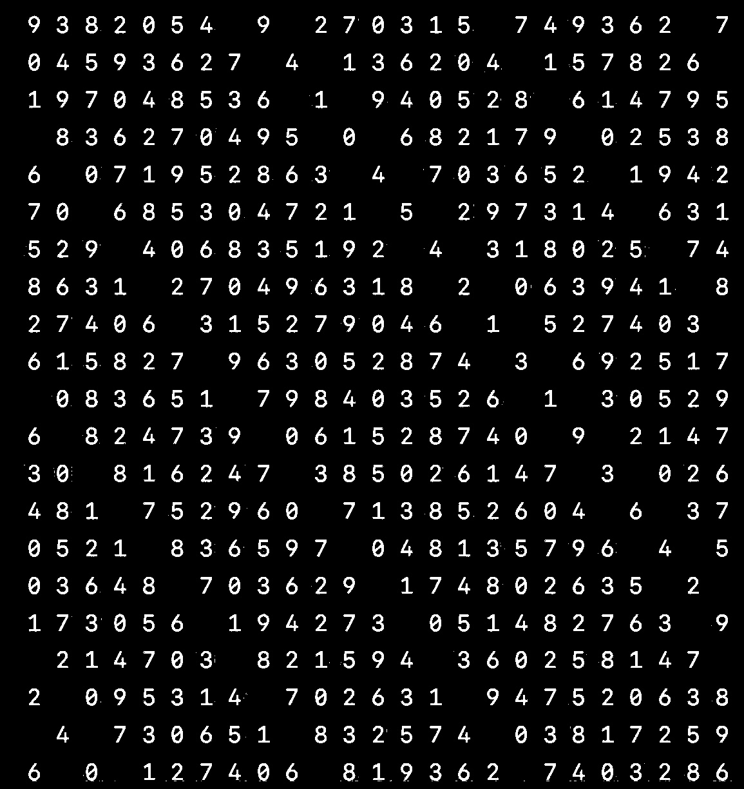

# 🔐 - Análise Criptográfica com Cifra de César e Baby-step Giant-step

[](https://www.python.org/)
[](LICENSE)
[](https://en.wikipedia.org/wiki/Cryptography)

## 🧠 Frase Central

> *A decifração é a arte de transformar o oculto em compreensível.*
> Este projeto mostra como métodos clássicos e modernos de criptografia — como a **Cifra de César** e o **Baby-step Giant-step** — podem ser aplicados para decodificar mensagens escondidas em imagens e textos.

---

  

---

## 📜 Sumário

* [1. Introdução à Criptografia](#1-introdução-à-criptografia)

  * [1.1 Resumo](#11-resumo)
  * [1.2 Conceitos Principais](#12-conceitos-principais)
  * [1.3 Explicação Detalhada](#13-explicação-detalhada)
  * [1.4 Aplicações](#14-aplicações)
  * [1.5 Análise do Processo](#15-análise-do-processo)
* [2. Script `puzzle_decoder.py`](#2-script-puzzle_decoderpy)

  * [2.1 Relação com a Criptografia](#21-relação-com-a-criptografia)
  * [2.2 Objetivo do Script](#22-objetivo-do-script)
  * [2.3 Exemplo de Saída](#23-exemplo-de-saída)
  * [2.4 Funcionamento Interno](#24-funcionamento-interno)
  * [2.5 Tecnologias e Requisitos](#25-tecnologias-e-requisitos)
* [3 Extras](#3-extras)

  * [3.1 Licença](#31-licença)
  * [3.2 Referências](#32-referencias)
  * [3.3 Testes e Validações](#33-testes-e-validações)
* [4 Contato](#4-contato)
* [5. Nota](#5-nota)

---

## 1. Introdução à Criptografia

### 1.1 Resumo

A **criptografia** é o estudo de técnicas para proteger informações por meio de codificação. Neste projeto, utilizamos métodos clássicos e modernos para analisar e tentar decifrar mensagens escondidas em textos e imagens.

### 1.2 Conceitos Principais

* **Cifra de César:** substitui cada letra por outra deslocada um certo número de posições no alfabeto.
* **Baby-step Giant-step:** algoritmo eficiente para resolver equações modulares do tipo *a^x ≡ b (mod n)*.
* **Análise de frequência:** identifica padrões de repetição de letras ou números em textos criptografados.

### 1.3 Explicação Detalhada

O script combina **técnicas de visão computacional** com **criptoanálise**. Ele primeiro extrai partes coloridas de uma imagem, que podem esconder letras ou códigos.
Depois, aplica **26 variações da Cifra de César** para tentar decifrar o texto.
Por fim, o **Baby-step Giant-step** é usado para resolver equações modulares e descobrir possíveis chaves criptográficas.

### 1.4 Aplicações

* Análise de desafios (*puzzles*) criptográficos.
* Recuperação de mensagens ocultas.
* Estudos de segurança e teoria dos números.
* Treinamento em técnicas de criptoanálise.

### 1.5 Análise do Processo

Cada módulo do script contribui para montar o quebra-cabeça:

1. A **visão computacional** identifica as regiões relevantes da imagem.
2. O **texto extraído** é testado contra deslocamentos de César.
3. A **análise numérica** reforça os resultados com estatísticas simples.
4. Por fim, as **melhores decodificações** são apresentadas ao usuário.

---

## 2. Script `puzzle_decoder.py`

### 2.1 Relação com a Criptografia

Este script é um **decodificador modular** que combina métodos clássicos e modernos para encontrar padrões escondidos em dados. Ele demonstra a aplicação prática de conceitos fundamentais da criptografia.

### 2.2 Objetivo do Script

O objetivo é:

✅ Carregar e processar uma imagem
✅ Detectar caracteres coloridos
✅ Testar os 26 deslocamentos da **Cifra de César**
✅ Implementar o **Baby-step Giant-step**
✅ Realizar **análise de frequência numérica**
✅ Exibir as **5 melhores decodificações**

### 2.3 Exemplo de Saída

```
============================================================
PUZZLE DECODER
Cifra de César + Baby-step Giant-step
============================================================

✅ Imagem carregada: puzzle.jpg
✅ Texto extraído: 5120 caracteres
✅ 137 caracteres destacados encontrados

🎯 Shift 19: POSSÍVEL MATCH!
   mensagemdecodificadaencontrada...

✅ Resultado: x = 4
   Verificação: 2^4 mod 17 = 16

Frequência de dígitos:
0: 135 vezes
1: 142 vezes
2: 138 vezes
...
```

### 2.4 Funcionamento Interno

1. **Extração visual:** usa OpenCV para identificar pixels coloridos e gerar máscaras HSV.
2. **Cifra de César:** tenta todos os deslocamentos possíveis no texto.
3. **Baby-step Giant-step:** resolve equações modulares do tipo *a^x ≡ b (mod n)*.
4. **Análise de frequência:** conta a ocorrência de cada dígito no texto.
5. **Seleção das top 5 decodificações** com base em padrões encontrados.

### 2.5 Tecnologias e Requisitos

* **Python 3.8.10**
* **Bibliotecas necessárias:**

  * `opencv-python`
  * `numpy`
  * `Pillow`
  * `collections`, `math`, `re`, `os`, `sys`

---

## 3 Extras

### 3.1 Licença

Distribuído sob a licença MIT. Consulte o arquivo `LICENSE` para mais detalhes.

### 3.2 Referencias

* [Cifra de César](https://pt.wikipedia.org/wiki/Cifra_de_C%C3%A9sar)
* [Baby-step Giant-step Algorithm](https://en.wikipedia.org/wiki/Baby-step_giant-step)
* [Análise de frequência](https://en.wikipedia.org/wiki/Frequency_analysis)

### 3.3 Testes e Validações

O script foi testado em **Ubuntu 20.04**, **Python 3.8.10**, com diferentes imagens e textos para validar o comportamento dos algoritmos.

---

## 4 Contato

* Feito por **CanalQb** no GitHub
* Visite o blog: canalqb.blogspot.com [🔗 https://canalqb.blogspot.com](https://canalqb.blogspot.com)
* 💸 Apoie o projeto via **Bitcoin:** `13Ve1k5ivByaCQ5yer6GoV84wAtf3kNava`
* **PIX:** [qrodrigob@gmail.com](mailto:qrodrigob@gmail.com)

*Readme.md corrigido por ChatGPT*

---

## 5. Nota

**criptografia:** técnica de transformar mensagens legíveis em códigos ocultos.
**Cifra de César:** substituição de letras por outras deslocadas no alfabeto.
**Baby-step Giant-step:** método para resolver problemas modulares rapidamente.
**modular:** operação que calcula o resto da divisão entre dois números.
**análise de frequência:** contagem de quantas vezes cada símbolo aparece.
**shift (deslocamento):** número de posições que as letras são movidas na cifra.
**HSV:** modelo de cores (matiz, saturação e valor) usado para detectar tons específicos em imagens.
