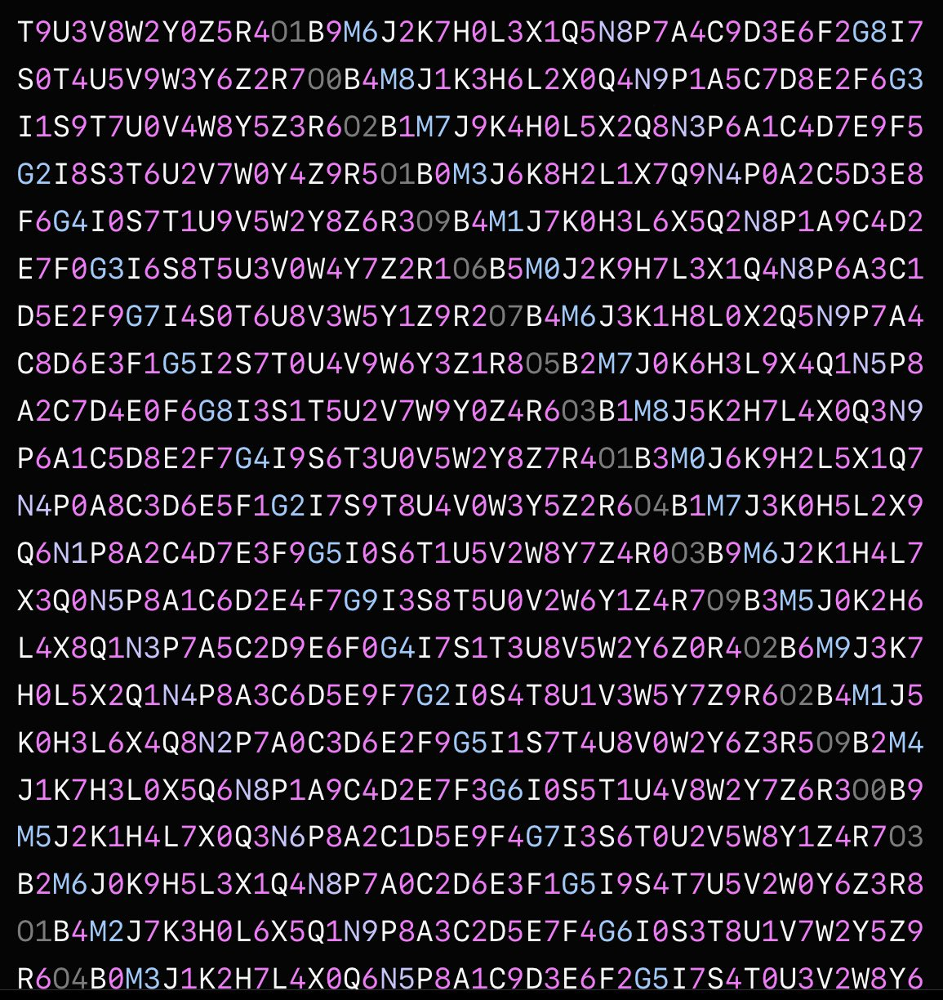

# 🧩 Puzzle 0.02BTC - Analisador de Imagem 
[](https://www.python.org/)
[](LICENSE)
[](https://github.com/)

## Frase do Puzzle

> **Today I wanted to do something special.** I’ve been in Bitcoin for many years now and I’ve loved it.  
> I want to give you all the chance to win 0.02 BTC ≈ $2,000.00. Best of luck to you all!  
> Everything for the private key can be found within this message.  
> **Address (proof of funds):** [bc1qr5mssp6snmduqp9enx4dzmcxvk7qw83lceyy2v](https://www.blockchain.com/pt/explorer/addresses/btc/bc1qr5mssp6snmduqp9enx4dzmcxvk7qw83lceyy2v)

Link original: https://x.com/Graduallyp/status/1870319691295764655
 
  

[**Mais em canalqb:**](http://bit.ly/3Ly5faw)  

## Sumário

* [1. Introdução ao Puzzle](#1-introdução-ao-Puzzle)
  * [1.1 Resumo](#11-resumo)
  * [1.2 Exemplos Práticos](#12-exemplos-práticos)
  * [1.3 Explicação Detalhada](#13-explicação-detalhada)
  * [1.4 Aplicações](#14-aplicações)
  * [1.5 Análise da Tabela](#15-análise-da-tabela)
* [2. Script `puzzle_analyzer.py`](#2-script-puzzle_analyzerpy)
  * [2.1 Relação com o Puzzle](#21-relação-com-o-Puzzle)
  * [2.2 Objetivo do Script](#22-objetivo-do-script)
  * [2.3 Exemplo de Saída](#23-exemplo-de-saída)
  * [2.4 Funcionamento Interno](#24-funcionamento-interno)
  * [2.5 Tecnologias e Requisitos](#25-tecnologias-e-requisitos)
* [3 Extras](#3-extras)
  * [3.1 Licença](#31-licença)
  * [3.2 Referências](#32-referencias)
  * [3.3 Testes e Validações](#33-testes-e-validações)
* [4 Contato](#4-contato)
* [5. Nota](#5-nota)

---

## 1 Introdução ao Puzzle

### 1.1 Resumo
Este script analisa imagens dividindo-as em pequenas células e identifica quais cores **não estão dentro do espectro do arco-íris**. Depois, combina estas cores para criar **WIFs demonstrativos** (tipo chaves privadas Bitcoin) e também calcula um **pseudo-inverso baseado em Mersenne**.

### 1.2 Exemplos Práticos
- Identificar células de uma imagem que têm cores estranhas ou raras.
- Gerar exemplos de chaves Bitcoin a partir de imagens.
- Criar desafios tipo puzzle com base em cores.

### 1.3 Explicação Detalhada
1. A imagem é dividida em **linhas e colunas**.
2. Cada célula é convertida para cores **RGB**.
3. O script verifica se cada cor está dentro de **faixas de matiz do arco-íris**.
   - Se não estiver, é marcada como fora do arco-íris.
4. Todas as cores fora do arco-íris são combinadas em uma **string hexadecimal**.
5. Essa string é transformada em **WIFs** demonstrativos, que representam chaves Bitcoin fictícias.
6. O script também calcula um **pseudo-inverso** baseado em um número de Mersenne (2^31-1).

### 1.4 Aplicações
- Jogos ou desafios educativos envolvendo cores e criptografia.
- Experimentos visuais para aprendizado de codificação.
- Criação de puzzles relacionados a Bitcoin e blockchain.

### 1.5 Análise da Tabela
O script imprime no console tabelas com:
- Valores mínimos de saturação e brilho.
- Número de colunas testadas.
- Quantidade de cores fora do arco-íris.
- WIFs correspondentes.

---

## 2 Script `puzzle_analyzer.py`

### 2.1 Relação com o Puzzle
Embora não seja um Puzzle matemático clássico, o script se baseia em **lógica de conjuntos e probabilidade** para identificar cores fora de um espectro definido.

### 2.2 Objetivo do Script
Gerar uma forma de representar dados visuais (cores fora do arco-íris) como **chaves criptográficas demonstrativas**, permitindo criar puzzles baseados em imagens.

### 2.3 Exemplo de Saída
```

SAT_MIN=0.25 | VAL_MIN=0.3 | COLS=10 | Fora do arco-íris: 5 | HEX muito curto para WIF
WIF não comprimido: <exemplo>
WIF comprimido:     <exemplo>
WIF inverso não comprimido: <exemplo>
WIF inverso comprimido:     <exemplo>

```

### 2.4 Funcionamento Interno
- `is_rainbow_color`: verifica se a cor pertence ao arco-íris.
- `is_non_rainbow`: identifica cores fora do arco-íris.
- `rgb_to_hex`: converte cores em formato hexadecimal.
- `to_wif_from_hex`: cria chaves demonstrativas WIF a partir do hex.
- `pseudo_inverse_wif`: calcula inverso pseudo-Mersenne para diversificação das chaves.

### 2.5 Tecnologias e Requisitos
- **Python 3.8.10**
- Bibliotecas: `PIL`, `numpy`, `colorsys`, `hashlib`, `base58`.

---

## 3 Extras

### 3.1 Licença
MIT License — uso livre para aprendizado, pesquisa e experimentos.

### 3.2 Referências
- [Python Pillow](https://pillow.readthedocs.io/)
- [Base58](https://en.bitcoin.it/wiki/Base58Check_encoding)
- [Matiz do arco-íris](https://en.wikipedia.org/wiki/Hue)

### 3.3 Testes e Validações
- O script imprime saídas diferentes para cada combinação de saturação e brilho.
- Testado em imagens JPEG e PNG.

---

## 4 Contato
- Feito por CanalQb no GitHub  
- Blog: [canalqb.blogspot.com](https://canalqb.blogspot.com)  
- 💸 Apoie o projeto via Bitcoin: 13Ve1k5ivByaCQ5yer6GoV84wAtf3kNava  
- PIX: [qrodrigob@gmail.com](mailto:qrodrigob@gmail.com)  

*Readme.md corrigido por ChatGPT*

---

## 5. Nota

- **RGB**: modelo de cores usando **vermelho (R), verde (G) e azul (B)** para criar outras cores.  
- **Hexadecimal (HEX)**: forma de representar cores com números e letras (0–9 e a–f).  
- **Saturação (S)**: intensidade da cor. 0 = sem cor, 1 = cor intensa.  
- **Brilho / Valor (V)**: quão claro ou escuro é a cor.  
- **WIF (Wallet Import Format)**: formato que representa chaves privadas de Bitcoin de maneira compacta.  
- **Pseudo-inverso Mersenne**: técnica matemática para gerar um número “invertido” baseado em números especiais (2^31-1).  

---
